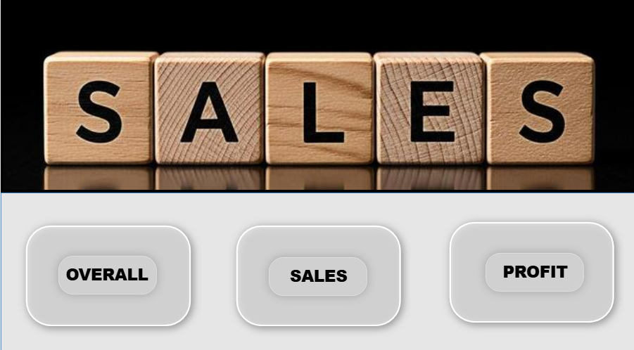
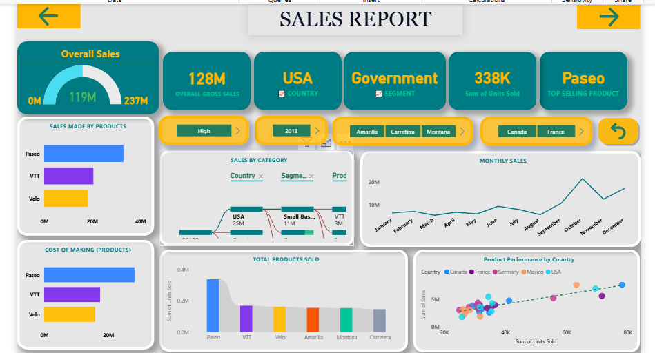

# 📊 Financial Analysis Dashboard (Power BI)

## 📌 Project Overview
This project focuses on analyzing financial performance using Power BI. The dashboard provides insights into revenue, profit&loss,
and overall business trends to support data-driven decision-making.

---

## 🛠 Tools & Technologies
- Power BI
- Power Query
- DAX
- Excel / CSV Dataset

---

## 📊 Key KPIs
- Total Revenue
- Total Profit
- Total Sales
- Profit Margin (%)
- Year-over-Year Growth
- Top Performing product

---

## 🔍 Key Insights
- Revenue showed consistent growth over time, with a peak in Q3.
- A small group of products contributed to the majority of profits.
- Certain regions underperformed compared to others.
- Some product categories had high sales but low profit margins.

---

## 💡 Business Recommendations
- Focus on high-performing products and regions to maximize revenue.
- Optimize or reduce low-profit product categories.
- Improve performance in underperforming regions through targeted strategies.
- Monitor profit margins regularly to maintain profitability.

---

## 📷 Dashboard Preview

---

## 📁 Files Included
- Power BI Dashboard (.pbix)
- Dashboard screenshots

---

## 🚀 Project Outcome
This project demonstrates the ability to clean, analyze, and visualize data to extract meaningful insights and support business decisions.

---

## 🔗 Portfolio
(https://github.com/Dowfi)
